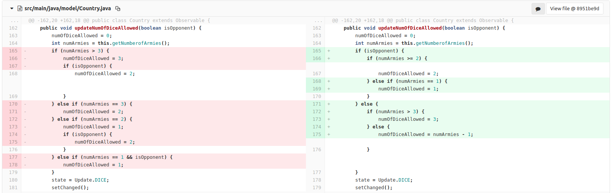
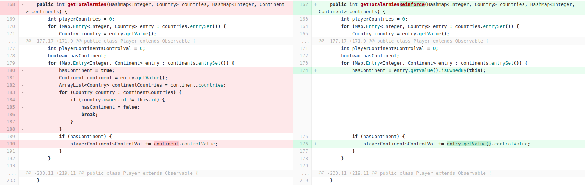
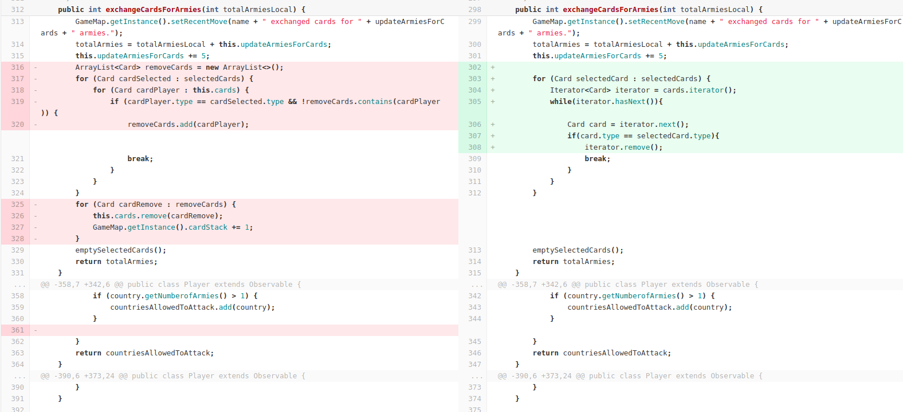
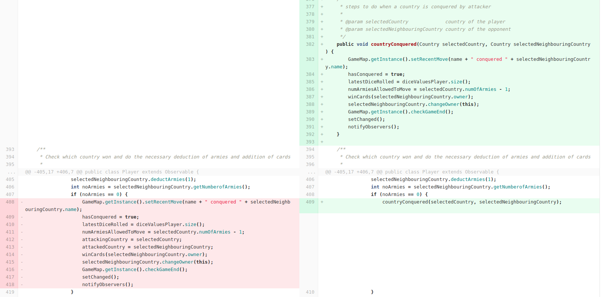

### List of refactorings made

* Change the logic of dice allowed for both player and defender in Country Model
* Remove unnecessary and unused variables
* Change the logic of getting total number of armies for reinforcement
* remove redundant arraylist with the help of iterator for card removal
* created a new function called CountryConquered to remove redundant code while checking victory
* other minor refactorings suggested by IDE lint

### Methods used to determine points
* team discussion
* peer programing
* IDE lint suggestions

### how we chose the targets

* for every phase of the game, we checked if the code could be optimized
* We checked if refactor targets were backed by test cases 
* Refactorings were thought in order to simplify the coding process required for the strategy patterns we needed for future builds.

* 
  instead of checking the number of armies and then checking if it is opponent or now, first we check if it is opponent or not and then decide the number of dice allowed 
* 
  there was already a function that checks if the continent is owned by anyone, reuse of that function instead of coding again.
* 
  removing redundant arraylist with the help of iterator.
* 
  country conquered will be checked in every attack for every strategy so a new function was created.
 